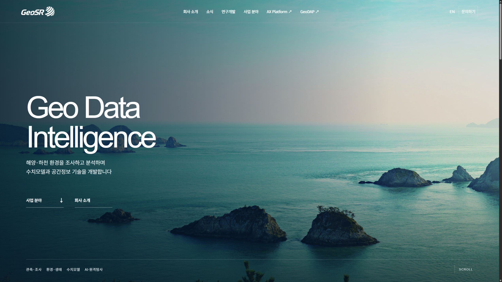
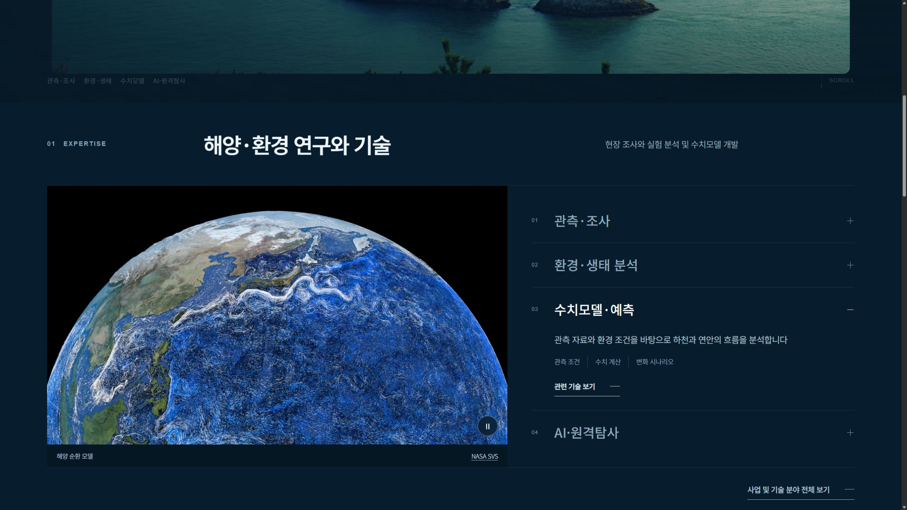
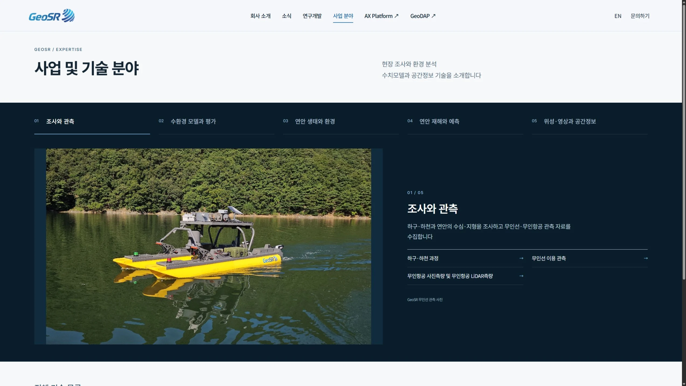
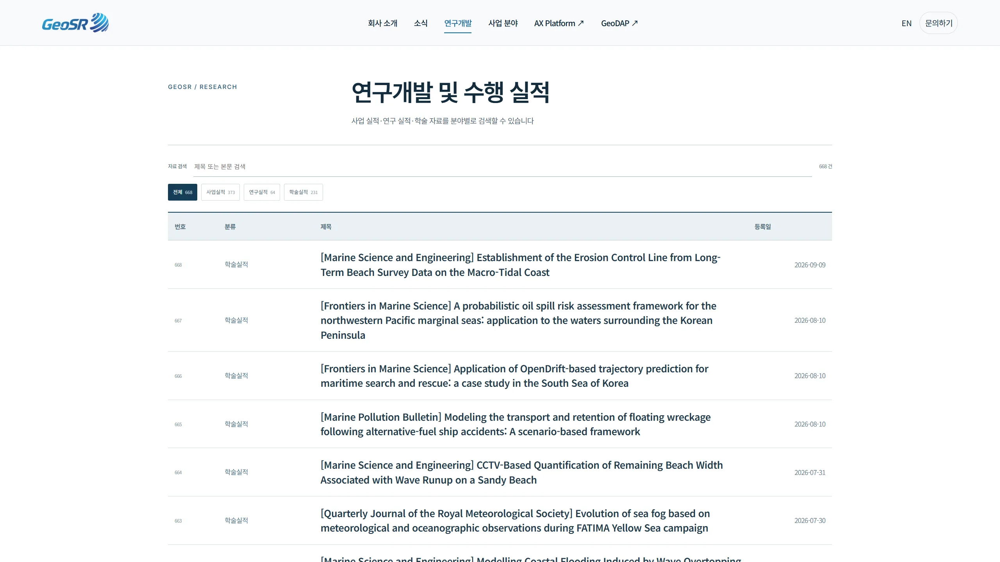
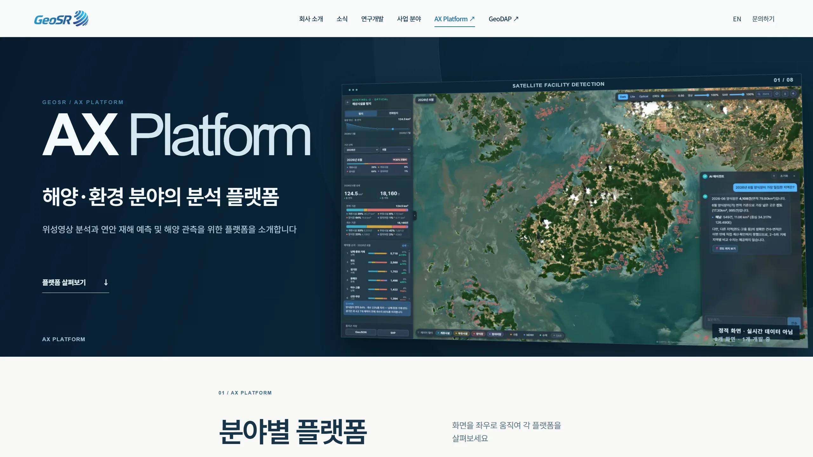
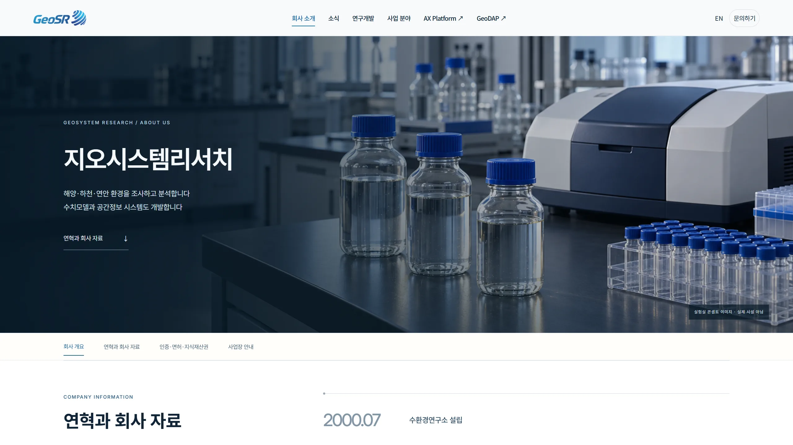

<p align="center"></p>

# GeoSR 기업 홈페이지

해양·하천·연안 환경을 조사하고 분석하는 지오시스템리서치의 국·영문 홈페이지입니다. 메인은 대표 기술과 플랫폼을 보여 주고 연구개발·소식·장비·인증 자료는 각 페이지에서 검색할 수 있습니다.



## 화면 미리보기



대표 기술 영역은 분야 선택과 미디어가 함께 전환됩니다. 수치모델 설명에는 [NASA SVS](https://svs.gsfc.nasa.gov/5425/)의 1080p 해양 순환 시각화를 사용하며 출처와 재생 제어를 제공합니다. AX 곡면형 가로 갤러리는 직원 제작 화면을 기반으로 유지합니다.

| 사업 및 기술 | 연구개발 |
| :--- | :--- |
| [](docs/screenshots/business-desktop.webp) | [](docs/screenshots/research-desktop.webp) |
| AX Platform | 회사 소개 |
| [](docs/screenshots/ax-platform-desktop.webp) | [](docs/screenshots/company-desktop.webp) |

[모바일 메인](docs/screenshots/home-mobile.webp) · [기술 상세](docs/screenshots/business-detail-desktop.webp) · [소식](docs/screenshots/news-desktop.webp) · [장비](docs/screenshots/equipment-desktop.webp) · [문의](docs/screenshots/contact-desktop.webp) · [자료실](docs/screenshots/records-desktop.webp)

스크린샷은 `docs/screenshots/`에 페이지별로 보관합니다. 위 첫 화면은 2026-09-28 로컬 QHD 2560×1440 캡처이며 실제 이미지 폭은 스크롤바를 제외한 2545px입니다. 기존 페이지별 캡처는 화면 변경 후 다시 검수해야 합니다.

## 사이트 구성

| 페이지 | 내용 |
| :--- | :--- |
| 메인 | 회사소개서의 실제 연안 사진을 임시 첫 화면으로 사용, 대표 사업 분야, AX Platform·GeoDAP, 회사 개요와 최신 소식 |
| 사업 분야 | 다섯 영역과 21개 기술의 국·영문 상세 설명 |
| 연구개발 | 국문 사업·연구·학술 기록 719건과 분야별 검색 |
| AX Platform | [직원 제작 AX 저장소](https://github.com/123choigem-tech/geosr-homepage-ax-platforms)의 AX 관련 화면과 자료를 사이트에 삽입 |
| 회사 소개 | 전문 분야, 연혁, 회사 자료, 인증·등록·지식재산권 명칭 127개와 사업장 정보 |
| 소식·장비 | 공개 소식 384건, 장비·조사선 80건의 개별 검색 화면 |

GeoDAP은 독립 서비스입니다. 메인에 [GeoDAP 공개 홈페이지](https://www.geo-dap.com/)의 실제 화면 캡처를 소개하고 해당 서비스로 이동합니다. AX 화면은 로컬 자산으로 삽입했으며 실시간 운영 화면으로 표시하지 않습니다.

## 로컬 실행

Python 환경에서 저장소 루트 기준:

```powershell
python -m http.server 18102 --directory dist
```

`http://127.0.0.1:18102/`에서 확인할 수 있습니다. 같은 네트워크에서는 현재 호스트의 LAN 주소 `http://192.168.6.85:18102/`로 볼 수 있습니다. 이 주소는 인터넷 공개 URL이 아닙니다. 배포 대상은 `dist/`의 정적 HTML·CSS·JavaScript·이미지입니다.

## 검수

```powershell
node scripts/build_business_details.mjs
node scripts/build_credential_index.mjs
node scripts/verify_redesign_routes.mjs
node scripts/verify_metadata_accessibility.mjs
node scripts/verify_film_lifecycle.mjs
python scripts/verify_public_archive.py
```

원본 공개 글의 텍스트는 `dist/source-archive.json`에 보존했습니다. 원본 이미지·첨부파일과 현재 인증 유효 여부는 별도 확인 대상입니다. 회사 본편과 Higgsfield 요소별 영상은 제작 전이며 첫 화면에는 2025년 회사소개서에서 가져온 연안 사진을 임시로 표시합니다. 사진의 촬영 장소·일자는 아직 확인되지 않았습니다.

설계·검수 기록은 [작업 시작 문서](docs/redesign-next/00-START-HERE.md), [현재 화면 결정](docs/redesign-next/13-HOME-REBUILD-20260928.md), [회사 업무 근거](docs/redesign-next/16-COMPANY-FILM-EVIDENCE-20260928.md), [영상 콘티](docs/redesign-next/14-1080P-FILM-STORYBOARD-20260928.md)에 있습니다.
