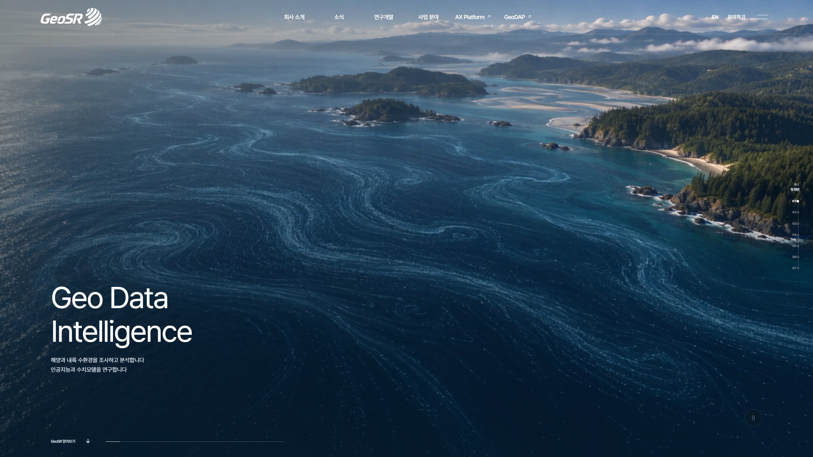
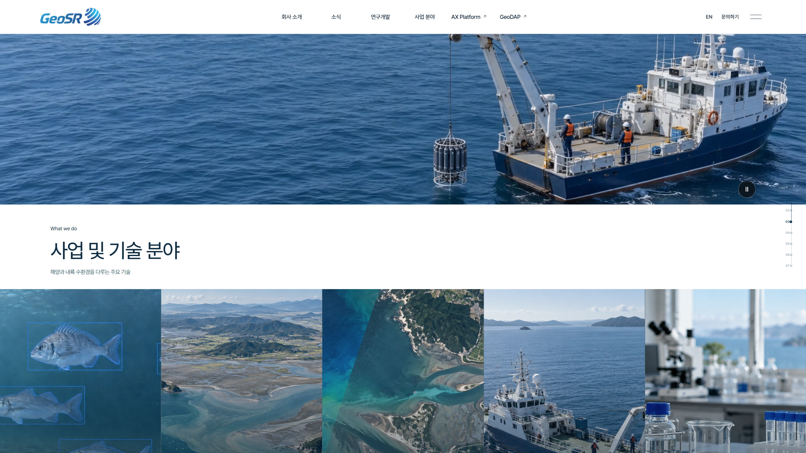
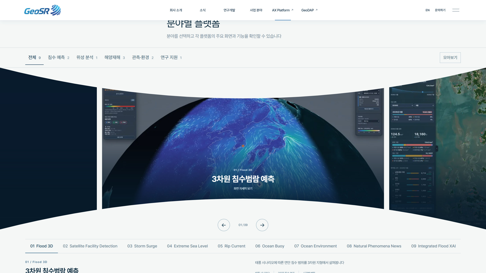
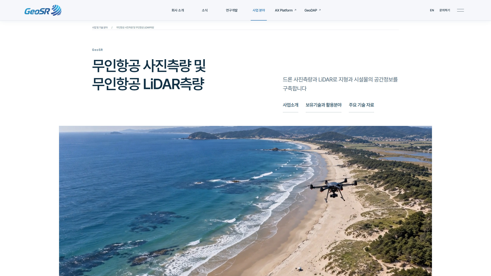
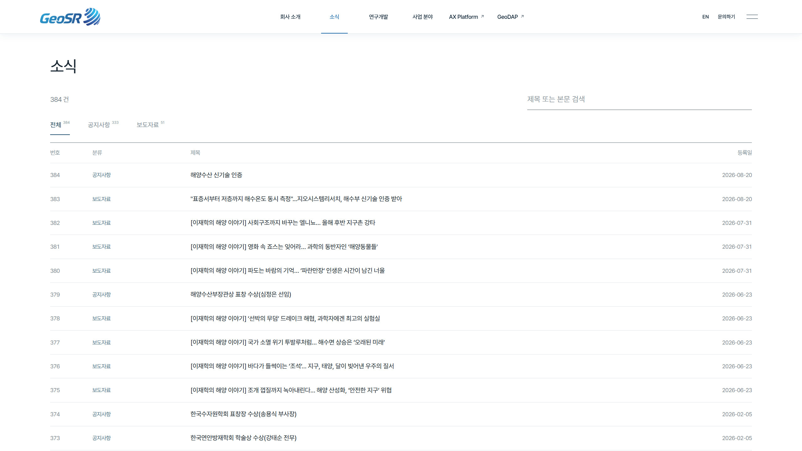
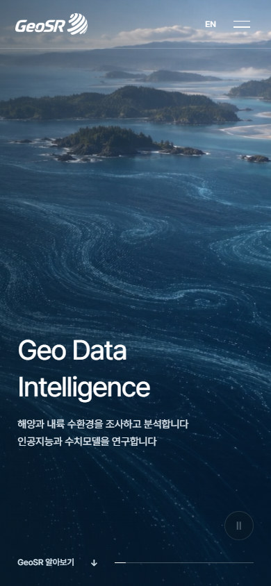
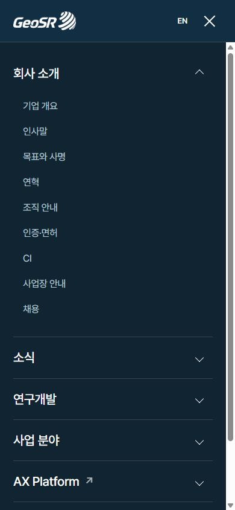
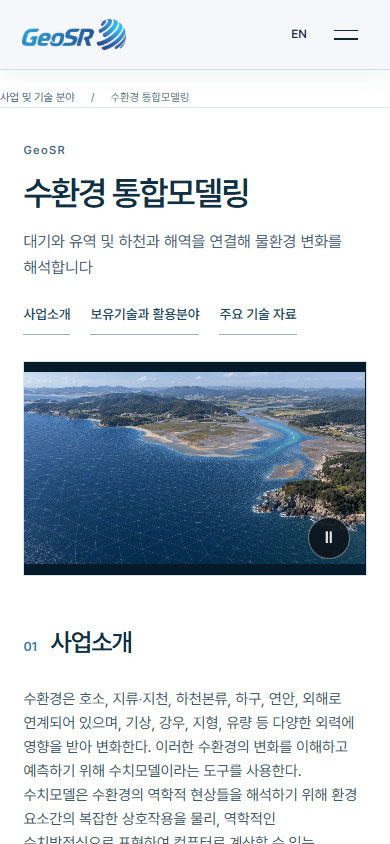

<p align="center"></p>

# Geo Data Intelligence

[전체 페이지 설계와 수정 기준](docs/redesign-next/MASTER-SITE-DESIGN.md)

지오시스템리서치의 국문·영문 기업 홈페이지

해양과 하천·호수·댐의 현장 업무와 인공지능·수치모델·공간정보 기술을 소개합니다
메인에서는 대표 기술과 플랫폼을 보여주고 상세 페이지에서는 원문 자료와 실제 기술 사례를 확인할 수 있습니다



*2026년 9월 29일 2560×1440 CSS viewport의 로컬 미리보기입니다. 당시 검수 화면이며 이후 영상과 회사 소개 이미지가 갱신되었습니다*

> **현재 상태** · 메인에는 27.5초 1080p 무음 영상 7개 장면을 연결했습니다 위성 관측으로 시작하며 CTD 장면은 3초로 늘리고 해양 흐름 장면을 마지막에 배치했습니다 회사 소개에는 회사의 업무 전반을 표현한 다크 인포그래픽을 배치했습니다 AI 대표 장면은 어류 이미지로 유지하고 해파리 영상은 사용하지 않습니다. 기술 상세의 원문 지도·그래프·장비 사진은 자료 영역에 보존합니다. 국문과 영문 및 모바일 화면은 계속 감수 중이며 이 사이트는 공식 geosr.com 배포본이 아닙니다

이미지마다 쓰임을 따로 정합니다. 넓은 첫 화면은 해당 업무 환경을 설명하는 콘셉트 장면으로 구성하고 실제 GeoSR 결과가 필요한 위치에는 원래 지도·그래프·장비 사진을 그대로 둡니다. 콘셉트와 원자료는 캡션과 배치로 구분하며 실제 자료는 임의로 자르거나 새로 그리지 않습니다.

## 기술을 보여주는 화면



메인에는 대표 분야 5개를 함께 보여주고 사업 페이지에는 전체 8개 분야와 21개 기술 상세를 둡니다
메인 분야 카드는 데스크톱에서 펼쳐지고 모바일에서는 가로 스크롤로 살펴볼 수 있습니다. AX Platform의 곡면 갤러리는 휠과 드래그로 이동합니다
대표 이미지는 설명용 콘셉트이며 실제 모델의 추론 결과나 관측 수치를 주장하지 않습니다

| AX Platform | 무인항공 사진측량 상세 |
| :--- | :--- |
| [](docs/screenshots/20260929-design-review/ax-gallery-qhd-ko.jpg) | [](docs/screenshots/20260929-design-review/technology-uav-qhd-ko.jpg) |

*AX Platform과 기술 상세의 내부 미리보기입니다. 실제 제품 화면과 설명용 도입 이미지를 구분해 사용합니다.*



[회사 소개](docs/screenshots/20260929-design-review/company-qhd-ko.jpg) · [연혁](docs/screenshots/20260929-design-review/company-history-qhd-ko.jpg) · [사업 분야](docs/screenshots/20260929-design-review/business-qhd-ko.jpg) · [연구개발](docs/screenshots/20260929-design-review/research-qhd-ko.jpg) · [보도자료](docs/screenshots/20260929-design-review/news-press-qhd-ko.jpg) · [장비](docs/screenshots/20260929-design-review/equipment-qhd-ko.jpg) · [채용](docs/screenshots/20260929-design-review/careers-qhd-ko.jpg) · [문의](docs/screenshots/20260929-design-review/contact-qhd-ko.jpg)

AX Platform은 [직원 제작 저장소](https://github.com/123choigem-tech/geosr-homepage-ax-platforms)의 곡면 가로 갤러리와 제품 자료를 로컬에 삽입했습니다
[GeoDAP](https://www.geo-dap.com/)은 실제 메인 화면을 잘림 없이 소개하는 별도 외부 서비스입니다

## 모바일

<p>
  
  
  
</p>

최신 페이지별 캡처 조건과 검수 결과는 [2026년 9월 29일 화면 기록](docs/screenshots/20260929-design-review/README.md)에 보관합니다
스크린샷은 진행 상태를 보여주며 전체 페이지의 최종 디자인 승인을 뜻하지 않습니다
현재 버전의 파일과 유지보수 절차는 [인계 시작점](docs/handoff/CURRENT-STATE.md)에서 확인할 수 있습니다

분야별 이미지 선택과 원문 자료의 위치는 [미디어 배치표](docs/redesign-next/reviews/media-placement-matrix-20260929.md)에서 확인할 수 있습니다
해상풍력 입지정보 페이지에는 전용 콘셉트 장면을 두고 원본 입지 지도와 해양 이용 자료는 기술 자료 영역에 보존합니다

## 정보 구성

| 메뉴 | 내용 |
| :--- | :--- |
| 회사 소개 | 기업 개요 · 인사말 · 목표와 사명 · 연혁 · 조직 · 인증 · CI · 사업장 · 채용 |
| 소식 | 공지와 언론 보도 384건 |
| 연구개발 | 사업 406건 · 연구 82건 · 학술 231건 |
| 사업 분야 | 8개 기술 분야 · 21개 기술 상세 · 6개 사업 적용 분야 |
| 장비 | 관측 장비와 조사선 80건 |
| AX Platform | 분야별 분석 플랫폼과 직원 제작 곡면 갤러리 |
| GeoDAP | 외부 지구환경 데이터 플랫폼 |

국문 원문을 기준으로 한영 화면의 기록 수와 첨부 자료를 맞춥니다
기존 국문·영문 원문 2024건은 보존하며 번역은 원문 hash에 연결된 별도 파일로 관리합니다
인증·등록·지식재산권 명칭 127개는 회사 소개의 문서 갤러리에서 제공합니다
검토가 필요한 문서 이미지의 보호 상태와 현재 인증 유효성은 별도 확인 대상입니다

화면 구성은 한화오션의 메뉴 전개와 전폭 미디어 및 스크롤 흐름을 가깝게 적용하고 GeoSR의 콘텐츠와 색상 및 자체 이미지로 완성합니다
어떤 레이아웃 원리를 어디에 적용했는지는 [레퍼런스 대조표](docs/redesign-next/reviews/geosr-reference-crosswalk-20260928.md)에 기록합니다
메인과 회사 안내·연혁·상선·혁신·R&D·뉴스 화면에서 직접 확인한 시각 검토는 [실시간 페이지 대조 기록](docs/redesign-next/reviews/hanwha-live-visual-review-20260929.md)에 적었습니다
메인 오른쪽 구간 탐색은 스크롤 위치와 연결되어 회사 소개·기술 분야·AX·GeoDAP·수환경 연구·소식으로 바로 이동합니다. 화면을 밀어 넘기는 동작은 사용하지 않습니다

## 로컬 실행

```powershell
python -m http.server 18102 --directory dist
```

[로컬 미리보기](http://127.0.0.1:18102/)에서 확인할 수 있습니다
웹 배포 대상은 `dist/`이며 Python 서버는 로컬 미리보기 용도입니다
문의 화면은 메일 작성 방식이며 서버에서 전송 완료를 보증하지 않습니다

## 저장소와 인계

현재 버전을 실행하고 유지보수하는 데 필요한 파일만 관리합니다
사용 에셋과 원문·번역·첨부자료 및 코드와 현재 설계·제작 기록을 보존합니다
원본 다운로드와 미채택 생성 결과 및 과거 캡처와 수집 로그는 저장소 밖의 로컬 보관소에 분리했습니다

```text
dist/                   현재 웹 코드와 사용 에셋 및 원문·번역 데이터
docs/handoff/           현재 상태와 코드 안내 및 저장소 관리 기준
docs/media/             사용 이미지·영상의 출처와 프롬프트 및 구간표
docs/company-audit/     현재 회사 정보와 기술 분류의 근거
docs/redesign-next/     현행 설계 방향과 관련 검토
docs/source-migration/  현재 이관·번역 검토 기록
docs/screenshots/       현재 화면 설명에 필요한 캡처
scripts/                현행 유지보수와 검증 도구
```

[인계 시작점](docs/handoff/CURRENT-STATE.md) · [코드 안내](docs/handoff/CODE-GUIDE.md) · [Git 관리 기준과 원본 보관 위치](docs/handoff/REPOSITORY-POLICY.md) · [사용 미디어 기록](docs/media/CURRENT-MEDIA.md)

## 검증

```powershell
python -X utf8 scripts/verify_repository_package.py
node scripts/verify_redesign_routes.mjs
node scripts/verify_metadata_accessibility.mjs
node scripts/verify_film_lifecycle.mjs
python -X utf8 scripts/verify_news_translations.py
```

자동 검증과 실제 화면 검수는 구분합니다
현재 재생 영상과 정지 이미지의 구분은 `dist/film-manifest.json`으로 관리합니다
설명용 장면은 관측값이나 검증된 예측 결과로 표시하지 않습니다
원문 충실성 검사는 별도 보관소의 수집 원본을 지정하며 [인계문](docs/handoff/CURRENT-STATE.md)에 실행법을 기록합니다
자료 재구축 도구는 현재 정적 버전을 임의로 다시 생성하는 용도로 실행하지 않습니다

[현재 디자인 기준](docs/redesign-next/CURRENT-DIRECTION.md) · [회사 조사](docs/company-audit/README.md) · [기술과 적용 분야](docs/company-audit/presentation-direction.md)
